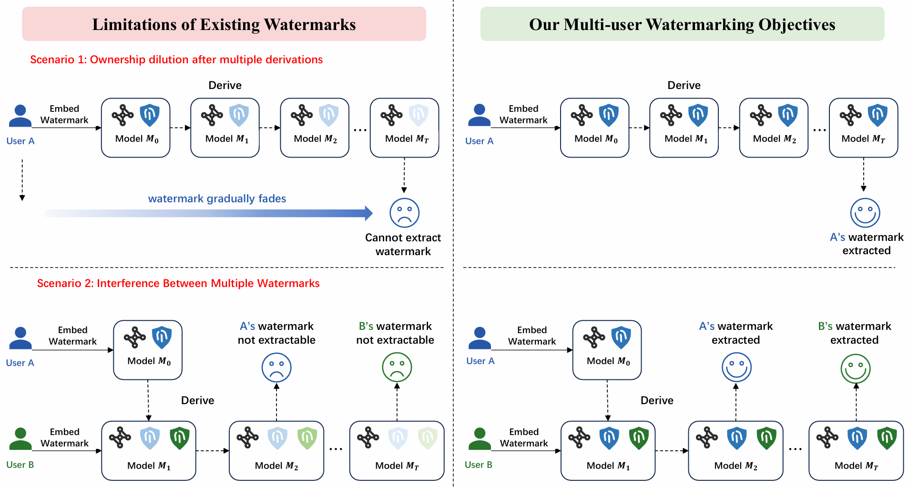
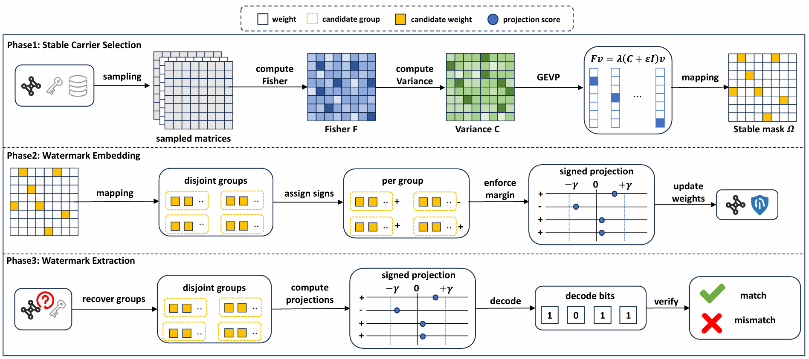

# LineageMark

LineageMark is a multi-user white-box watermarking framework for contribution tracing in large language model derivation chains.

The project studies an open model ecosystem in which a base model is repeatedly derived by different users through full-parameter fine-tuning. Each derived model may contain contributions from the current user and all previous users in the lineage.

The motivating model-derivation scenario and the overall LineageMark framework are illustrated below.

<p align="center">
  
</p>

<p align="center">
  
</p>

LineageMark is designed to support:

- Robust extraction of historical user watermarks after multiple rounds of full-parameter fine-tuning.
- Coexistence of multiple users' watermarks within the same model lineage.
- White-box verification of user contributions from model parameters.

The current implementation uses DSSA-based matrix-level subspace selection and keyed statistical watermark embedding. In the default setting, each user provides an independent password and watermark payload, and the code derives the user's private watermark coordinates from the password.

## Repository Structure

```text
LineageMark/
|-- bash_multi/                 # Optional shell helpers for watermark experiments
|-- dssa_multi/                 # Command-line entry points for LineageMark, ELLMark, and EmMark
|-- eval/                       # PPL, zero-shot, and stable-space evaluation scripts
|-- figures/                    # README and paper figures
|-- finetune_model/             # Full-parameter fine-tuning scripts
|-- lib_multi/                  # Core implementation: subspace selection, insertion, extraction, utilities
|-- prepare_data/
|   |-- law/                    # Legal-domain preprocessing scripts
|   |-- math/                   # Math-domain preprocessing scripts
|   `-- pubmed/                 # Biomedical-domain preprocessing scripts
|-- download_model_from_huggingface.py
|-- download_dataset_from_huggingface.py
|-- requirements.txt
`-- README.md
```

All commands below assume that they are executed from the repository root.

## Environment Setup

The experiments are intended to run on a CUDA GPU environment such as AutoDL. The examples below assume a Linux shell on AutoDL.

### 1. Clone the repository

```bash
cd /root/autodl-tmp
git clone https://github.com/xuxiaofeng0411/LineageMark.git
cd LineageMark
mkdir -p outputs logs
```

The `outputs/` and `logs/` directories are used by the commands below to save regenerated evaluation JSON files and command logs inside the current project.

### 2. Create and activate a virtual environment

Using conda:

```bash
conda create -n lineagemark python=3.10 -y
conda activate lineagemark
```

This creates an isolated Python environment named `lineagemark`, so the packages required by this project will not affect other experiments.

### 3. Install dependencies

```bash
pip install -r requirements.txt
```

`requirements.txt` records the Python packages required by the project, such as PyTorch, Transformers, Datasets, Hugging Face Hub, bitsandbytes, AutoGPTQ, NumPy, and tqdm.

If your AutoDL image already contains a CUDA-specific PyTorch version, you may keep the existing PyTorch installation and install the remaining packages manually. Make sure that the installed PyTorch version matches the CUDA version of your AutoDL environment.

### 4. Optional Hugging Face mirror settings

Several scripts already set the Hugging Face mirror internally. You can also set it explicitly:

```bash
export HF_ENDPOINT=https://hf-mirror.com
export TOKENIZERS_PARALLELISM=false
```

If the model or dataset requires authentication, set your Hugging Face token:

```bash
export HF_API_TOKEN=hf_xxxxxxxxxxxxxxxxxxxxxxxxx
```

## Prepare Model and Data

### 1. Download a base model

For example, download `facebook/opt-125m`:

```bash
python -u download_model_from_huggingface.py \
  --repo_id facebook/opt-125m
```

When this command is run from `/root/autodl-tmp/LineageMark`, the model is saved under:

```text
/root/autodl-tmp/models/facebook/opt-125m
```

Most experiment commands in this README use the following path convention:

```text
/root/autodl-tmp/models/...     # model checkpoints
/root/autodl-tmp/datasets/...   # raw and processed datasets
./outputs/...                   # regenerated JSON results in this project
./logs/...                      # command logs in this project
```

If your workspace uses a different layout, replace these paths consistently in the commands.

### 2. Prepare domain fine-tuning datasets

The watermark insertion step uses WikiText-2 as the default DSSA calibration dataset and will load it automatically. For model derivation experiments, you also need domain-specific fine-tuning datasets.

Biomedical example:

```bash
python -u prepare_data/pubmed/prepare_pubmed_dataset.py \
  --parquet_path /root/autodl-tmp/datasets/train-00000-of-00052.parquet \
  --model_path /root/autodl-tmp/models/facebook/opt-125m \
  --output_dir /root/autodl-tmp/datasets/processed_pubmed1_35k \
  --sample_size 35000 \
  --train_ratio 0.9 \
  --max_length 512 \
  --overwrite
```

Math example:

```bash
python -u prepare_data/math/prepare_mathinstruct_dataset.py \
  --json_path /root/autodl-tmp/datasets/MathInstruct.json \
  --model_path /root/autodl-tmp/models/facebook/opt-125m \
  --output_dir /root/autodl-tmp/datasets/processed_math1_35k \
  --sample_size 35000 \
  --train_ratio 0.9 \
  --max_length 512 \
  --overwrite
```

Legal-domain example:

```bash
python -u prepare_data/law/prepare_ledgar_dataset.py \
  --parquet_path /root/autodl-tmp/datasets/law1.parquet \
  --model_path /root/autodl-tmp/models/facebook/opt-125m \
  --output_dir /root/autodl-tmp/datasets/processed_law1_35k \
  --sample_size 35000 \
  --train_ratio 0.9 \
  --max_length 512 \
  --overwrite
```

The preprocessing scripts tokenize raw data and save Hugging Face `Dataset` objects into `train/` and `val/` folders. The full-parameter fine-tuning scripts later load these processed folders directly with `load_from_disk`.

## Insert a User Watermark

The LineageMark insertion entry point is:

```text
dssa_multi/lineagemark_insert_watermark_multi.py
```

Example for the first user:

```bash
export CUDA_VISIBLE_DEVICES=0
export TOKENIZERS_PARALLELISM=false
export PYTORCH_CUDA_ALLOC_CONF=expandable_segments:True

python -u dssa_multi/lineagemark_insert_watermark_multi.py \
  --model /root/autodl-tmp/models/facebook/opt-125m \
  --save_model /root/autodl-tmp/models/facebook/opt-125m-mark1-nomark \
  --save_subspace /root/autodl-tmp/models/facebook/opt-125m-mark1-subspace.pt \
  --hidden_size 768 \
  --watermark mark \
  --password asdfqwer \
  --k 64 \
  --tau_lower 0.1 \
  --tau_upper 0.9 \
  --epsilon 1e-6 \
  --select_ratio 0.75 \
  --dssa_block_chunk 2 \
  --dssa_calib_batch_size 8 \
  --nsamples 128 \
  --seqlen 2048 \
  --seed 100 \
  --xi 4 \
  --position_num 12 \
  --delta 20 \
  --wm_method projection \
  --projection_margin 0.5 \
  --projection_max_update 0.0 \
  --data_independent_extract \
  2>&1 | tee outputs/insert_user1.log
```

Important arguments:

| Argument | Meaning |
| --- | --- |
| `--model` | Input model path. This can be the original model or a previously derived model. |
| `--save_model` | Output path of the watermarked model. |
| `--save_subspace` | Optional path for saving DSSA-selected masks and subspace information. |
| `--hidden_size` | Hidden size of the target model. For `facebook/opt-125m`, this is `768`. |
| `--watermark` | User watermark string. Each character is converted to 8 binary bits. |
| `--password` | User secret key. It controls layer selection, row selection, coordinate mapping, and projection signs. |
| `--k` | Number of DSSA subspace directions selected for each matrix. |
| `--tau_lower`, `--tau_upper` | Spectral truncation range used during DSSA subspace selection. |
| `--select_ratio` | Fraction of matrix coordinates selected globally for the editable weight mask. |
| `--nsamples` | Number of calibration samples used for DSSA statistics. |
| `--wm_method` | Watermark method. The default recommended method is `projection`. Other options are `mean_diff` and `bitflip`. |
| `--data_independent_extract` | Enables blind extraction. The extractor can verify the watermark using only the model, password, and expected watermark string. |

The insertion process has two phases:

1. **Matrix-level DSSA subspace selection**: the code computes stable matrix-level carrier regions using calibration data.
2. **Keyed watermark insertion**: the code edits only DSSA-selected weights while using the user's password to derive private watermark coordinates.

## Extract and Verify a Watermark

The LineageMark extraction entry point is:

```text
dssa_multi/lineagemark_extract_watermark_multi.py
```

Example:

```bash
python -u dssa_multi/lineagemark_extract_watermark_multi.py \
  --model /root/autodl-tmp/models/facebook/opt-125m-mark1-nomark \
  --hidden_size 768 \
  --watermark mark \
  --password asdfqwer \
  --chunk_length 8 \
  --xi 4 \
  --position_num 12 \
  --wm_method projection \
  --projection_margin 0.5 \
  --data_independent_extract \
  --mode simple \
  --seed 100 \
  2>&1 | tee outputs/extract_user1.log
```

The script prints:

```text
Real watermark:      ...
Extract watermark:   ...
Extract ACC:         ...
```

`Extract ACC` is the bit-level accuracy between the expected watermark and the extracted watermark. A valid user should obtain a high extraction accuracy. To estimate false positives, run the same extraction command with random wrong passwords and save each log under `outputs/` or `logs/`.

If you do not use `--data_independent_extract`, you need to provide the saved DSSA map:

```bash
python -u dssa_multi/lineagemark_extract_watermark_multi.py \
  --model /root/autodl-tmp/models/facebook/opt-125m-mark1-nomark \
  --hidden_size 768 \
  --watermark mark \
  --password asdfqwer \
  --watermark_map /root/autodl-tmp/models/facebook/opt-125m-mark1-subspace.pt \
  --wm_method projection \
  --mode simple \
  2>&1 | tee outputs/extract_user1_with_map.log
```

## Run a Multi-user Model Lineage Experiment

A typical model lineage is:

```text
M0
  -> user 1 inserts watermark W1
  -> full-parameter fine-tuning by user 1
  -> user 2 inserts watermark W2
  -> full-parameter fine-tuning by user 2
  -> user 3 inserts watermark W3
  -> ...
```

In this setting, the later model should still allow historical users to verify their own watermarks.

### Stage 1: user 1 inserts a watermark

```bash
python -u dssa_multi/lineagemark_insert_watermark_multi.py \
  --model /root/autodl-tmp/models/facebook/opt-125m \
  --save_model /root/autodl-tmp/models/facebook/opt-125m-mark1-nomark \
  --save_subspace /root/autodl-tmp/models/facebook/opt-125m-mark1-subspace.pt \
  --hidden_size 768 \
  --watermark mark \
  --password asdfqwer \
  --seed 100 \
  --wm_method projection \
  --projection_margin 0.5 \
  --xi 4 \
  --position_num 12 \
  --delta 20 \
  --k 64 \
  --tau_lower 0.1 \
  --tau_upper 0.9 \
  --epsilon 1e-6 \
  --select_ratio 0.75 \
  --dssa_block_chunk 2 \
  --dssa_calib_batch_size 8 \
  --nsamples 128 \
  --data_independent_extract \
  2>&1 | tee outputs/stage1_insert_user1.log
```

### Stage 2: full-parameter fine-tuning derives a new model

Edit the constants at the beginning of `finetune_model/full_finetune_125m.py`:

```python
DATA_PATH = "/root/autodl-tmp/datasets/processed_math1_35k"
WATERMARKED_MODEL_PATH = "/root/autodl-tmp/models/facebook/opt-125m-mark1-nomark"
FINETUNED_OUTPUT_DIR = "/root/autodl-tmp/models/facebook/opt-125m-mark1-nomark-ft-math"
EXPECTED_WATERMARK_DTYPE = torch.float16
```

Then run:

```bash
python -u finetune_model/full_finetune_125m.py \
  2>&1 | tee outputs/stage2_finetune_user1.log
```

The fine-tuning code intentionally keeps the saved model in `float16`. This is important because precision conversion, such as converting a watermarked `float16` model to `bfloat16`, may weaken or destroy fine-grained watermark signals.

### Stage 3: user 2 inserts a new watermark into the derived model

```bash
python -u dssa_multi/lineagemark_insert_watermark_multi.py \
  --model /root/autodl-tmp/models/facebook/opt-125m-mark1-nomark-ft-math \
  --save_model /root/autodl-tmp/models/facebook/opt-125m-mark2-nomark \
  --save_subspace /root/autodl-tmp/models/facebook/opt-125m-mark2-subspace.pt \
  --hidden_size 768 \
  --watermark bear \
  --password qihdnbji \
  --seed 62 \
  --wm_method projection \
  --projection_margin 0.5 \
  --xi 4 \
  --position_num 12 \
  --delta 20 \
  --k 64 \
  --tau_lower 0.1 \
  --tau_upper 0.9 \
  --epsilon 1e-6 \
  --select_ratio 0.75 \
  --dssa_block_chunk 2 \
  --dssa_calib_batch_size 8 \
  --nsamples 128 \
  --data_independent_extract \
  2>&1 | tee outputs/stage3_insert_user2.log
```

You can continue this process for user 3, user 4, and later users. Use a different `watermark`, `password`, and `seed` for each user.

### Verify historical users on a later derived model

For example, verify user 1 on a later-stage model:

```bash
python -u dssa_multi/lineagemark_extract_watermark_multi.py \
  --model /root/autodl-tmp/models/facebook/opt-125m-mark4-nomark \
  --hidden_size 768 \
  --watermark mark \
  --password asdfqwer \
  --wm_method projection \
  --projection_margin 0.5 \
  --xi 4 \
  --position_num 12 \
  --chunk_length 8 \
  --data_independent_extract \
  --mode simple \
  2>&1 | tee outputs/verify_user1_on_mark4.log
```

Verify user 2:

```bash
python -u dssa_multi/lineagemark_extract_watermark_multi.py \
  --model /root/autodl-tmp/models/facebook/opt-125m-mark4-nomark \
  --hidden_size 768 \
  --watermark bear \
  --password qihdnbji \
  --wm_method projection \
  --projection_margin 0.5 \
  --xi 4 \
  --position_num 12 \
  --chunk_length 8 \
  --data_independent_extract \
  --mode simple \
  2>&1 | tee outputs/verify_user2_on_mark4.log
```

If both users obtain high extraction accuracy, the later model contains evidence of both users' historical contributions.

## Using the Provided Shell Script

The script `bash_multi/bash_multi.sh` provides a compact way to run insertion, extraction, and false-positive verification. The direct commands above are the recommended reviewer-facing reproduction commands because they explicitly use the current LineageMark entry points:

```text
dssa_multi/lineagemark_insert_watermark_multi.py
dssa_multi/lineagemark_extract_watermark_multi.py
```

If you use `bash_multi/bash_multi.sh`, first check these variables:

```bash
model_path="/root/autodl-tmp/models/facebook/opt-125m"
save_model="/root/autodl-tmp/models/facebook/opt-125m-mark1-full"
save_subspace="/root/autodl-tmp/models/facebook/opt-125m-mark1-subspace-full.pt"
hidden_size=768
watermark="mark"
password="asdfqwer"
seed=100
```

Then run the LineageMark helper functions:

```bash
run_lineagemark_insert
run_lineagemark_extract
```

Run:

```bash
bash bash_multi/bash_multi.sh
```

This script is useful for batch experiments, especially when testing many wrong passwords to measure false-positive behavior. If an older local copy of the script still calls `dssa_insert_watermark_multi.py` or `dssa_extract_watermark_multi.py`, replace those names with `lineagemark_insert_watermark_multi.py` and `lineagemark_extract_watermark_multi.py`.

## Evaluate Model Utility

Watermarking should preserve the model's normal language modeling ability. This repository includes perplexity and zero-shot evaluation scripts under `eval/`.

### Perplexity evaluation

Use the generic PPL evaluator and pass model and dataset paths explicitly:

```bash
python -u eval/ppl_result.py \
  --model original=/root/autodl-tmp/models/facebook/opt-125m \
  --model mark1=/root/autodl-tmp/models/facebook/opt-125m-mark1-nomark \
  --dataset pubmed1=/root/autodl-tmp/datasets/processed_pubmed1_35k \
  --split val \
  --block_size 512 \
  --domain_batch_size 2 \
  --wikitext_batch_size 2 \
  --output_json outputs/ppl_result_pubmed1.json \
  2>&1 | tee outputs/ppl_result_pubmed1.log
```

The regenerated PPL result is saved to:

```text
outputs/ppl_result_pubmed1.json
```

The repository also contains domain-specific wrappers such as `eval/ppl_result_pubmed.py`, `eval/ppl_result_law.py`, and `eval/ppl_result_math.py`. Before using those wrappers, check the hard-coded `MODEL_SPECS`, dataset paths, and `DEFAULT_OUTPUT_JSON` values at the top of the file.

### Zero-shot evaluation

```bash
python -u eval/zero_shot_result.py \
  --model original=/root/autodl-tmp/models/facebook/opt-125m \
  --model watermark_1=/root/autodl-tmp/models/facebook/opt-125m-mark1-nomark \
  --model watermark_2=/root/autodl-tmp/models/facebook/opt-125m-mark2-nomark \
  --model watermark_4=/root/autodl-tmp/models/facebook/opt-125m-mark4-nomark \
  --tasks piqa,hellaswag,winogrande \
  --batch_size 16 \
  --max_length 512 \
  --output_json outputs/multi_stage_zero_shot_results.json \
  2>&1 | tee outputs/multi_stage_zero_shot_results.log
```

The regenerated zero-shot result is saved to:

```text
outputs/multi_stage_zero_shot_results.json
```

If some listed checkpoints are not available, either remove the corresponding `--model name=path` argument or add:

```bash
--skip_missing_models
```

## Practical Notes

### Hidden size

Set `--hidden_size` according to the target model configuration. For example:

```text
facebook/opt-125m: hidden_size = 768
```

For other models, check `config.json` or print `model.config.hidden_size`.

### Precision

The current watermark experiments are designed for `float16` checkpoints. Avoid unnecessary dtype conversion between watermark insertion, full-parameter fine-tuning, and extraction.

### CUDA memory

If DSSA selection runs out of memory, reduce one or more of the following parameters:

```text
--nsamples
--dssa_calib_batch_size
--dssa_block_chunk
```

For full-parameter fine-tuning, reduce:

```text
per_device_train_batch_size
gradient_accumulation_steps
max_length
```

### False-positive testing

A correct user should use the true pair:

```text
watermark + password
```

A non-user or wrong key should use an incorrect password. The extracted accuracy under wrong passwords is used to evaluate false-positive risk.

### Path configuration

Most commands in this README use AutoDL paths such as:

```text
/root/autodl-tmp/models/...
/root/autodl-tmp/datasets/...
```

Before running an experiment, check and update these paths according to your AutoDL workspace. The reviewer-facing commands save regenerated logs and JSON outputs under the current project:

```text
outputs/
logs/
```

## Core Implementation Files

- `lib_multi/subspace_multi.py`: matrix-level DSSA statistics, generalized eigenvalue problem, spectral truncation, and mask construction.
- `lib_multi/lineagemark_insert_multi.py`: LineageMark watermark insertion logic, including `projection`, `mean_diff`, and `bitflip`.
- `lib_multi/lineagemark_extract_multi.py`: LineageMark watermark extraction and bit-level accuracy calculation.
- `lib_multi/utils_multi.py`: model loading, layer traversal, keyed coordinate mapping, binary weight operations, and quantized weight conversion.
- `dssa_multi/lineagemark_insert_watermark_multi.py`: command-line interface for DSSA selection and LineageMark watermark insertion.
- `dssa_multi/lineagemark_extract_watermark_multi.py`: command-line interface for LineageMark watermark extraction.
- `dssa_multi/ellmark_insert_watermark_multi.py` and `dssa_multi/ellmark_extract_watermark_multi.py`: ELLMark baseline entry points.
- `dssa_multi/emmark_insert_watermark_multi.py` and `dssa_multi/emmark_extract_watermark_multi.py`: EmMark baseline entry points.

## Minimal Reproducible Workflow

The following is the shortest complete workflow for one-user insertion and extraction on OPT-125M. It downloads the model, inserts one watermark, extracts it, and saves logs under `outputs/`.

```bash
cd /root/autodl-tmp
git clone https://github.com/xuxiaofeng0411/LineageMark.git
cd LineageMark
mkdir -p outputs logs

conda create -n lineagemark python=3.10 -y
conda activate lineagemark
pip install -r requirements.txt

python -u download_model_from_huggingface.py --repo_id facebook/opt-125m

python -u dssa_multi/lineagemark_insert_watermark_multi.py \
  --model /root/autodl-tmp/models/facebook/opt-125m \
  --save_model /root/autodl-tmp/models/facebook/opt-125m-mark1-nomark \
  --save_subspace /root/autodl-tmp/models/facebook/opt-125m-mark1-subspace.pt \
  --hidden_size 768 \
  --watermark mark \
  --password asdfqwer \
  --seed 100 \
  --wm_method projection \
  --projection_margin 0.5 \
  --xi 4 \
  --position_num 12 \
  --delta 20 \
  --k 64 \
  --tau_lower 0.1 \
  --tau_upper 0.9 \
  --epsilon 1e-6 \
  --select_ratio 0.75 \
  --dssa_block_chunk 2 \
  --dssa_calib_batch_size 8 \
  --nsamples 128 \
  --data_independent_extract \
  2>&1 | tee outputs/minimal_insert.log

python -u dssa_multi/lineagemark_extract_watermark_multi.py \
  --model /root/autodl-tmp/models/facebook/opt-125m-mark1-nomark \
  --hidden_size 768 \
  --watermark mark \
  --password asdfqwer \
  --chunk_length 8 \
  --xi 4 \
  --position_num 12 \
  --wm_method projection \
  --projection_margin 0.5 \
  --data_independent_extract \
  --mode simple \
  2>&1 | tee outputs/minimal_extract.log
```

If the model paths are correct and the environment is properly configured, the final command should print a high `Extract ACC`.
